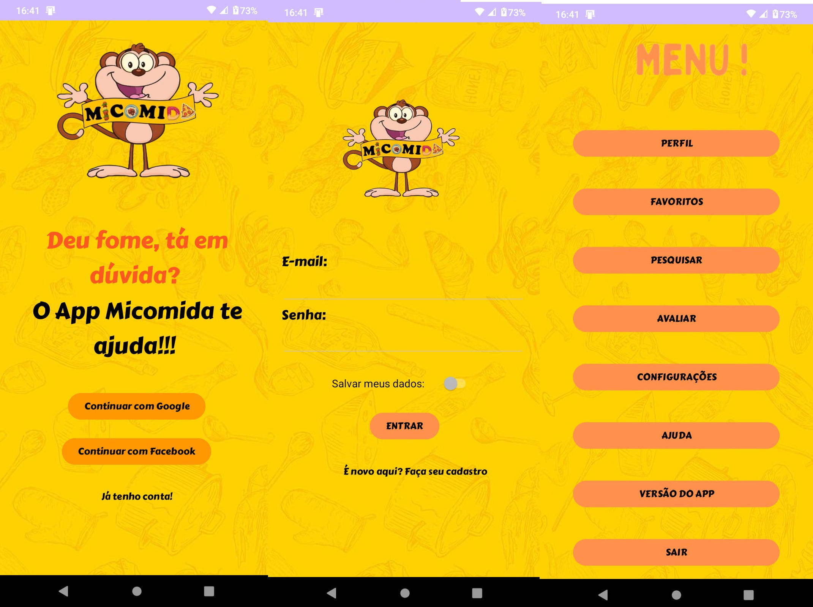
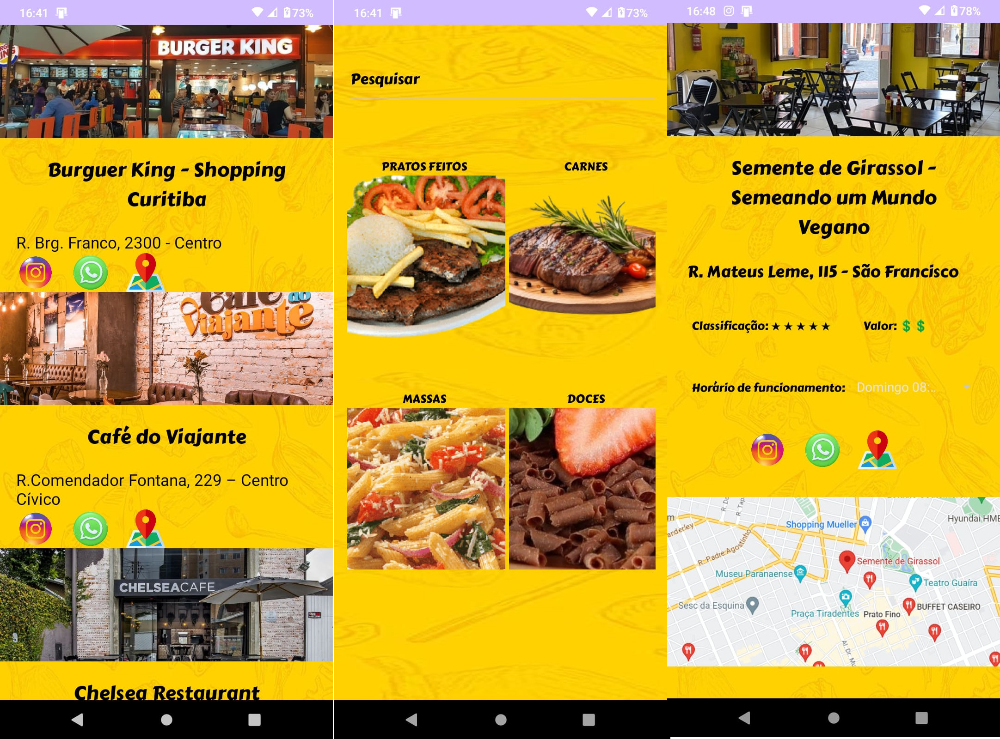

Projeto Integrador - Este repositório é referente a uma atividade avaliativa prática do Curso de Análise e Desenvolvimento de Sistemas, Responsáveis: Jeferson Alves e Vanessa Favero - Uniopet
Nosso grande objetivo é criar uma aplicação web e mobile onde você encontre os melhores lugares para comer, e perto da sua casa. Com o Micomida é só dar um clique que você encontra o que mais precisa.
Ao longo do curso nós desenvolvemos diversas práticas, como o front end ou popularmente 'visual', nela conseguimos integrar alguns conhecimentos como HTML, CSS, BOOTSTRAP, Bibliotecas JAVASCRIPT. 
Adiante tivemos a oportunidade de lidar com SQL, e diversos tipos de bancos de dados, como MYSQL, ORACLE, SQL SERVER. Inclusive para a elaboração do projeto para web, utilizamos PHP e MYSQL. 
Para a versão mobile, usamos  JAVA, KOTLIN e o ANDROID STUDIO na versão Giraffe. 

---------------------------------------------------------------------------------------------------------------------------------------------------------------------------------------------------------------
<h2 align="center">Contém aplicativo criado com a linguagem Kotlin, com interação de algumas telas:</h2>

- 📲 Cadastro de clientes
 
- 📲 Perfil pessoal

- 📲 Página dos restaurantes 

- 📲 Avaliação dos restaurantes
  
- 📲 Página de busca dos estabelecimentos  

----------------------------------------------------------------------------------------------------------------------------------------------------------------------------------------------------------------

<h2 align="center"> Telas de apresentação </h2>

---------------------------------------------------------------------------------------------------------------------------------------------------------------------------------------------------------------

Houveram tentativas de commits para inclusão dos arquivos e compactação dos mesmos, mas o tamanho dos arquivos são maiores do que permitido pelo Github. Foi anexado um video demonstrativo do funcionamento do aplicativo.
